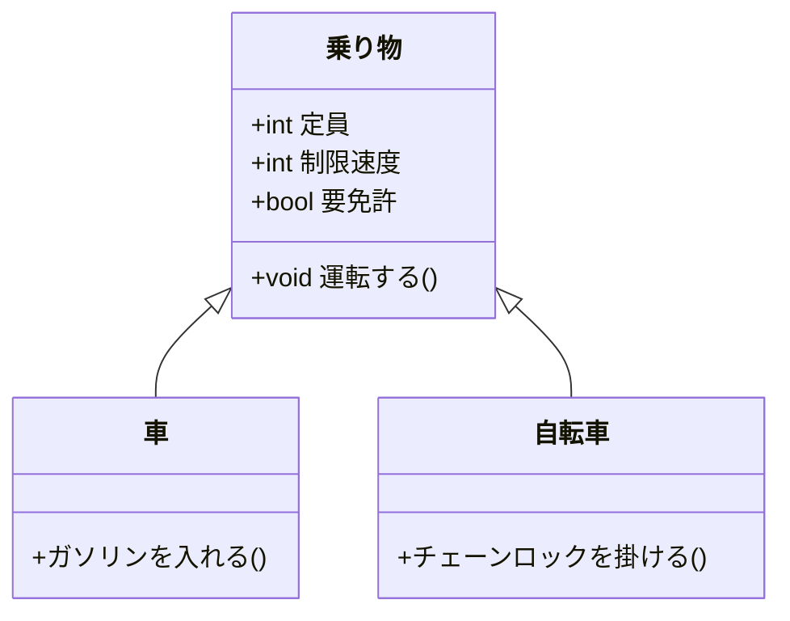

```mermaid

classDiagram
   class 乗り物
   乗り物 : +int 定員
   乗り物 : +int 制限速度
   乗り物 : +bool 要免許
   乗り物 : +void 運転する()
   
   class 車
   車 : +ガソリンを入れる()

   class 自転車
   自転車 : +チェーンロックを掛ける()

   乗り物 <|-- 車
   乗り物 <|-- 自転車

```