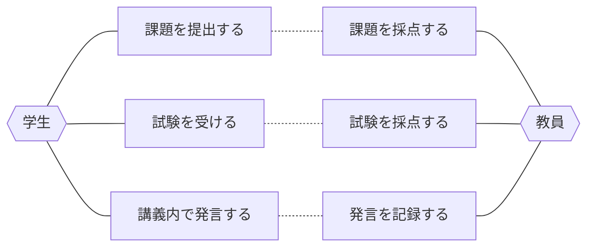

```mermaid
flowchart LR

学生{{学生}}
教員{{教員}}

提出[課題を提出する]
受ける[試験を受ける]
発言[講義内で発言する]

課題採点[課題を採点する]
試験採点[試験を採点する]
発言記録[発言を記録する]

学生 --- 提出
学生 --- 受ける
学生 --- 発言

課題採点 --- 教員
試験採点 --- 教員
発言記録 --- 教員


提出 -.- 課題採点
受ける -.- 試験採点
発言 -.- 発言記録

```