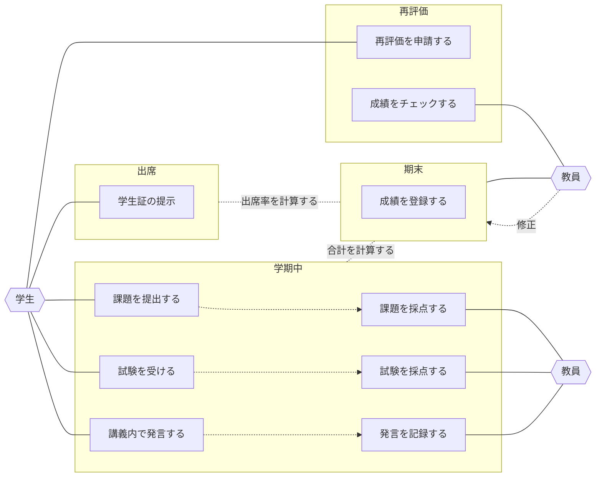

```mermaid
flowchart LR

学生{{学生}}
教員{{教員}}
教員2{{教員}}

subgraph 学期中
提出[課題を提出する]
受ける[試験を受ける]
発言[講義内で発言する]
 
課題採点[課題を採点する]
試験採点[試験を採点する]
発言記録[発言を記録する]
end

subgraph 期末
成績登録[成績を登録する]
end

subgraph 再評価
申請[再評価を申請する]
確認[成績をチェックする]
end

subgraph 出席
学生証[学生証の提示]
end

学生 --- 学生証

学生 --- 申請
確認 --- 教員2
教員2 -. 修正 .-> 期末 

学生 --- 提出
学生 --- 受ける
学生 --- 発言

課題採点 --- 教員
試験採点 --- 教員
発言記録 --- 教員

提出 -.-> 課題採点
受ける -.-> 試験採点
発言 -.-> 発言記録

学期中 -. 合計を計算する .- 期末
期末 --- 教員2

出席 -. 出席率を計算する .- 期末
```