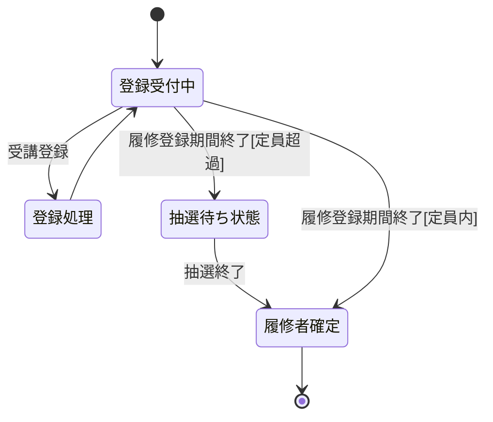

```mermaid

stateDiagram-v2
    direction TB
    
    uke : 登録受付中
    syo : 登録処理
    kaku : 履修者確定
    sen : 抽選待ち状態

    [*] --> uke
    uke --> syo : 受講登録
    syo --> uke
    uke --> sen : 履修登録期間終了[定員超過]
    sen --> kaku : 抽選終了
    uke --> kaku : 履修登録期間終了[定員内]
    kaku --> [*]

```