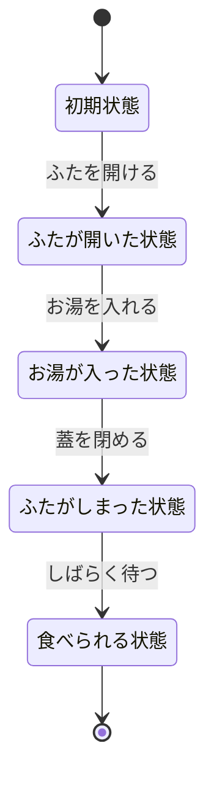

```mermaid

stateDiagram-v2
%%  direction LR
    direction TB
    s1 : 初期状態
    s2 : ふたが開いた状態
    s3 : お湯が入った状態
    s4 : ふたがしまった状態
    s5 : 食べられる状態

    [*] --> s1
    s1 --> s2 : ふたを開ける
    s2 --> s3 : お湯を入れる
    s3 --> s4 : 蓋を閉める
    s4 --> s5 : しばらく待つ
    s5 --> [*]
```