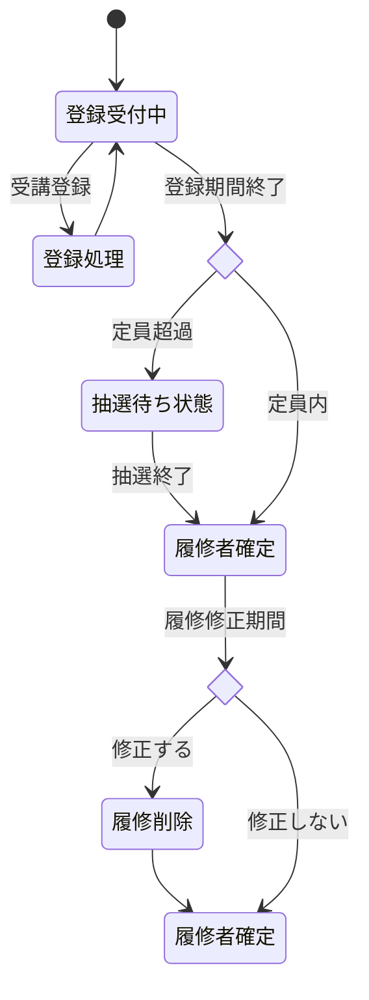

```mermaid

stateDiagram-v2
    direction TB
    
    uke : 登録受付中
    syo : 登録処理
    kaku : 履修者確定
    sen : 抽選待ち状態
    clear : 履修削除
    saikaku : 履修者確定

    [*] --> uke
    uke --> syo : 受講登録
    syo --> uke

    state 終了 <<choice>>
    uke --> 終了 : 登録期間終了
    終了 --> sen : 定員超過
    sen --> kaku : 抽選終了
    終了 --> kaku : 定員内
    
    state 修正 <<choice>>
    kaku --> 修正 : 履修修正期間
    修正 --> clear : 修正する
    clear --> saikaku 
    修正 --> saikaku :　修正しない
    

```