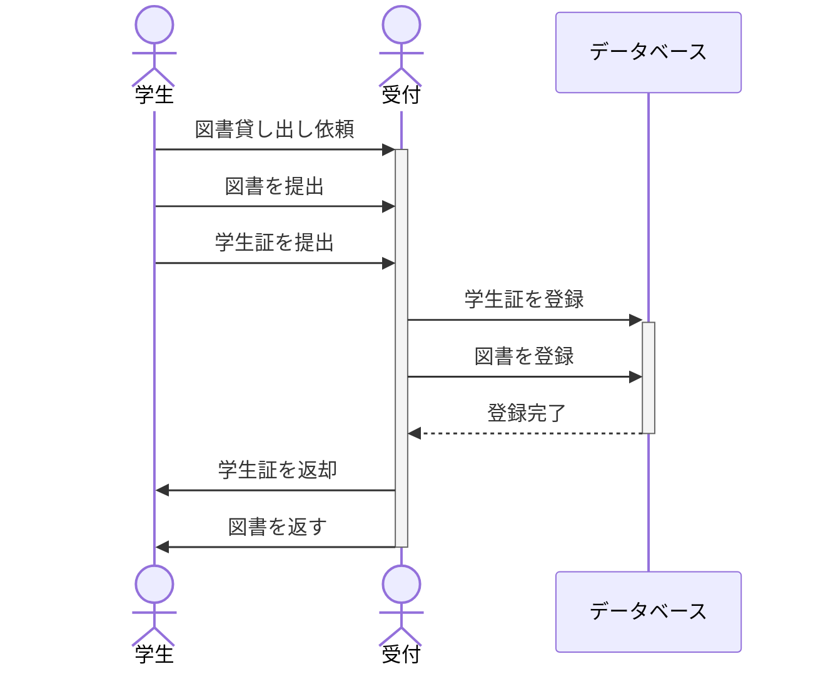

```mermaid

sequenceDiagram
actor s as 学生
actor r as 受付
participant db as データベース

s ->>+ r: 図書貸し出し依頼
s ->> r: 図書を提出
s ->> r: 学生証を提出

r ->>+ db: 学生証を登録
r ->> db: 図書を登録
db -->>- r: 登録完了

r ->> s: 学生証を返却
r ->>- s: 図書を返す
```