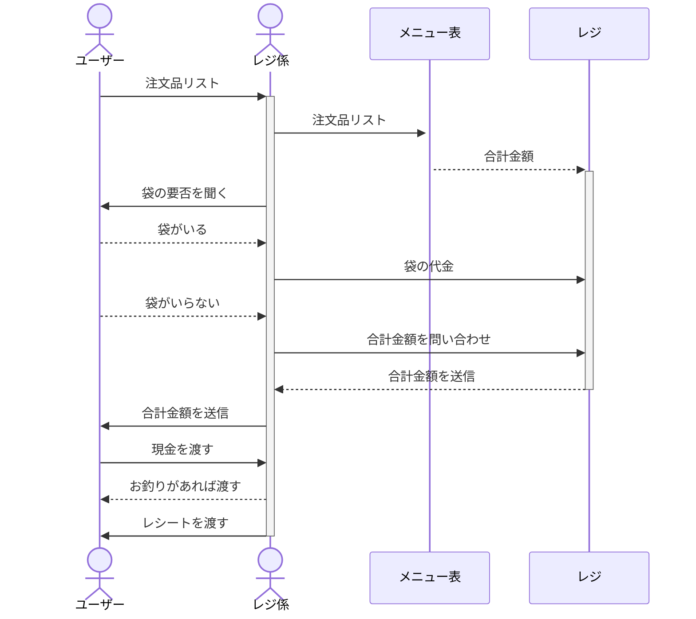

```mermaid

sequenceDiagram
actor user as ユーザー
actor rezi as レジ係
participant menu as メニュー表
participant rezidai as レジ

user ->>+ rezi: 注文品リスト
rezi ->>+ menu: 注文品リスト
menu -->>+ rezidai: 合計金額
rezi ->> user: 袋の要否を聞く
user -->> rezi: 袋がいる
rezi ->> rezidai: 袋の代金
user -->> rezi: 袋がいらない
rezi ->> rezidai:合計金額を問い合わせ
rezidai -->>- rezi: 合計金額を送信 
rezi ->> user: 合計金額を送信
user ->> rezi: 現金を渡す
rezi -->> user: お釣りがあれば渡す
rezi ->>- user: レシートを渡す

```