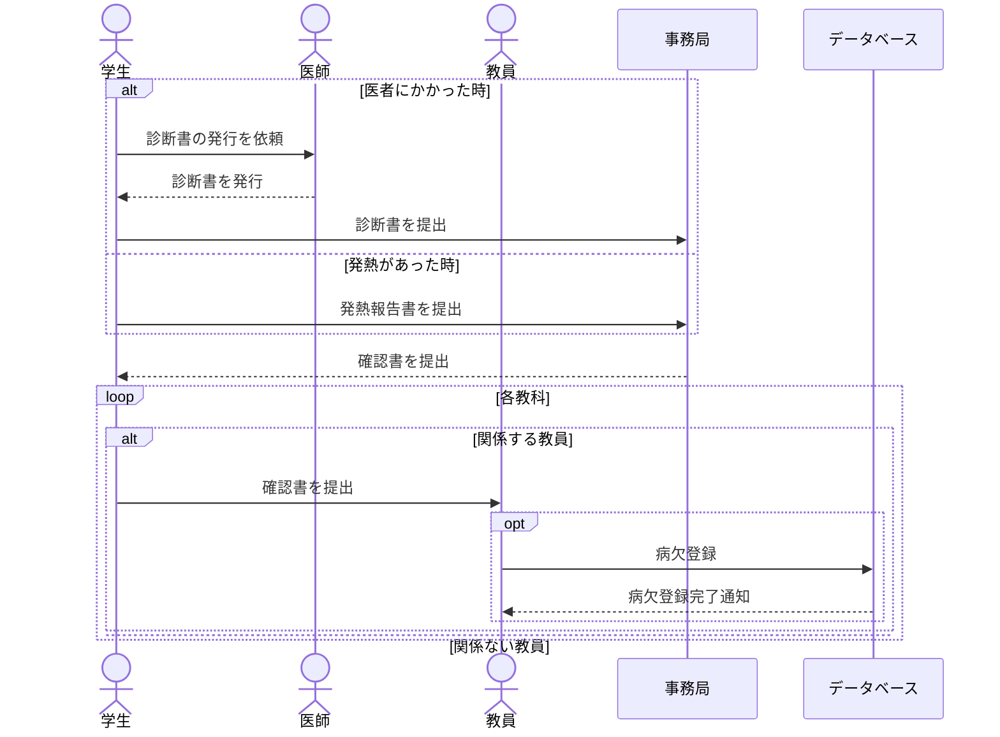

```mermaid

sequenceDiagram
actor s as 学生
actor r as 医師
actor a as 教員
participant z as 事務局
participant db as データベース

alt 医者にかかった時
s ->> r: 診断書の発行を依頼
r -->> s: 診断書を発行
s ->> z: 診断書を提出
else 発熱があった時
s ->> z: 発熱報告書を提出
end
z -->> s: 確認書を提出
loop 各教科
alt 関係する教員
 s ->> a: 確認書を提出
 opt 
  a ->> db: 病欠登録
db -->> a: 病欠登録完了通知
end
else 関係ない教員
end
end
```