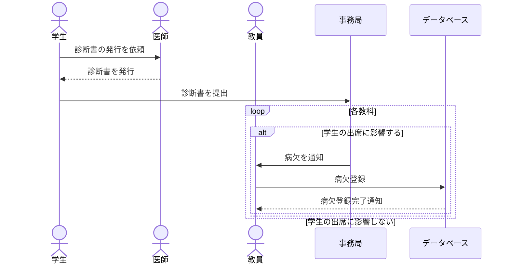

```mermaid

sequenceDiagram
actor s as 学生
actor r as 医師
actor a as 教員
participant z as 事務局
participant db as データベース

s ->> r: 診断書の発行を依頼
r -->> s: 診断書を発行
s ->> z: 診断書を提出
loop 各教科
alt 学生の出席に影響する
z ->> a: 病欠を通知
a ->> db: 病欠登録
db -->> a: 病欠登録完了通知
else 学生の出席に影響しない
end
end
```