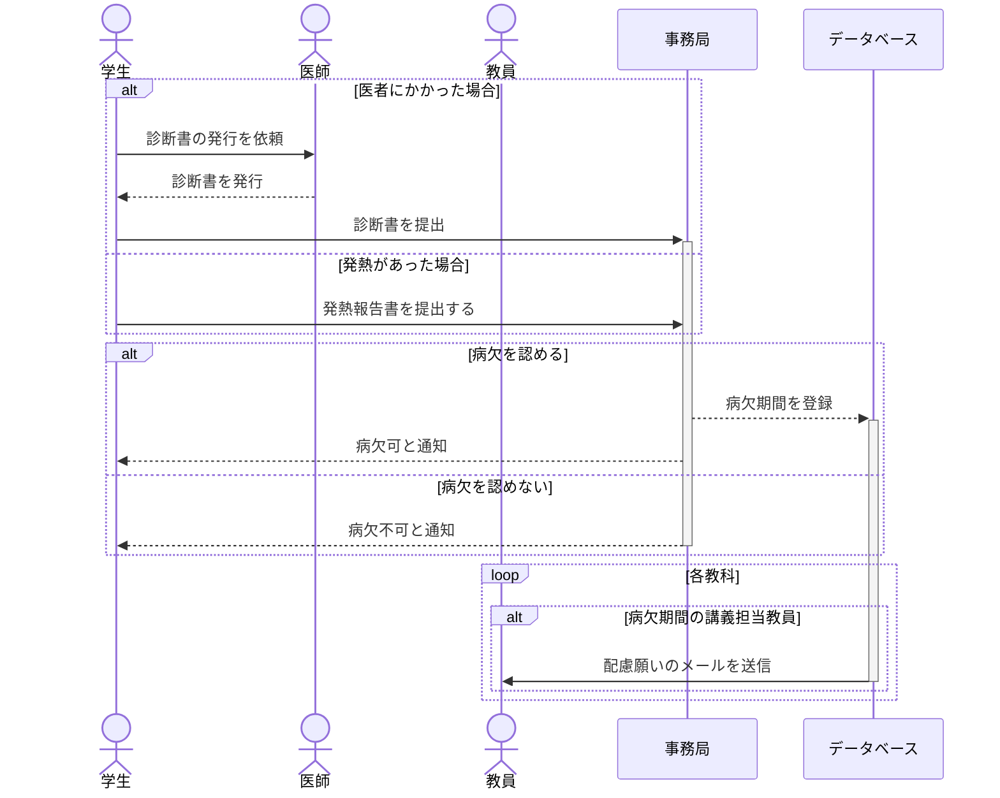

```mermaid

sequenceDiagram
actor s as 学生
actor r as 医師
actor a as 教員
participant z as 事務局
participant db as データベース

alt 医者にかかった場合
    s ->> r: 診断書の発行を依頼
    r -->> s: 診断書を発行
    s ->>+ z: 診断書を提出
else 発熱があった場合
    s ->> z: 発熱報告書を提出する
end

alt 病欠を認める
    z -->>+ db: 病欠期間を登録
    z -->> s: 病欠可と通知
else 病欠を認めない
    z -->>- s: 病欠不可と通知
end

loop 各教科
alt 病欠期間の講義担当教員
    db ->>- a: 配慮願いのメールを送信
end

end
```