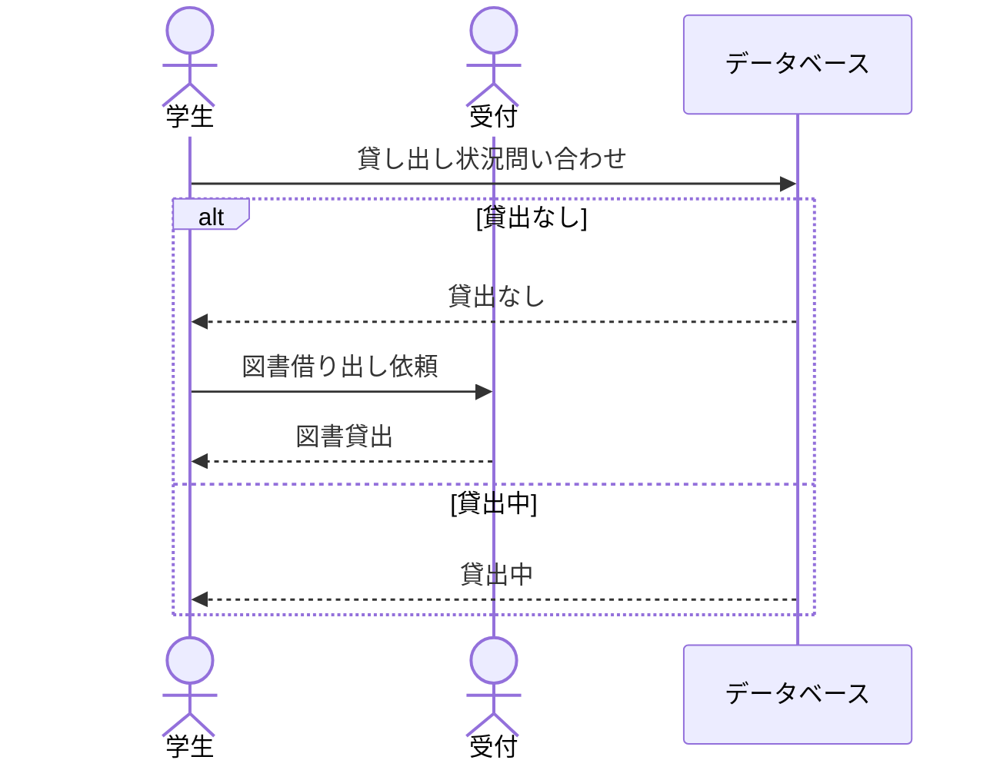

```mermaid

sequenceDiagram
actor s as 学生
actor r as 受付
participant db as データベース

%% s ->> r : 借り出し希望図書
%% loop 各図書について
%% r ->> db : 貸出登録
%% db -->> r : 登録完了通知
%% end
%% r ->> db : 登録終了通知
%% db -->> r : 登録終了確認
%% r ->> s : 貸出図書

s ->> db :貸し出し状況問い合わせ
alt 貸出なし
　db -->> s : 貸出なし
  s ->> r : 図書借り出し依頼
  r -->> s : 図書貸出
else 貸出中
  db -->> s : 貸出中
end

```