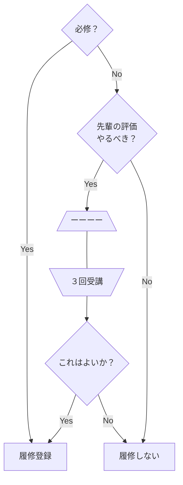

```mermaid

flowchart TD
hisshu{"必修？"}
senpai{"先輩の評価
        やるべき？"}
loop[/"ーーーー"\]
loopend[\"３回受講"/]
dameda{"これはよいか？"}

rishu["履修登録"]
pass["履修しない"]

hisshu -->|Yes| rishu
hisshu -->|No| senpai
senpai -->|Yes| loop
senpai -->|No| pass

loop --- loopend
loopend --> dameda
dameda -->|Yes| rishu
dameda -->|No| pass

```