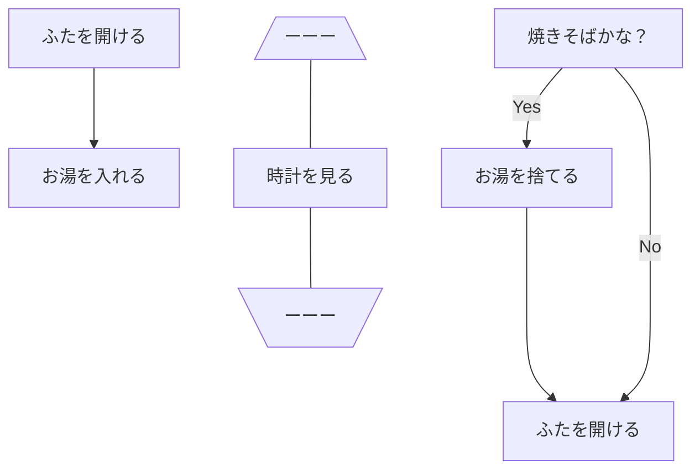

```mermaid

flowchart TD
open["ふたを開ける"]
water["お湯を入れる"]

%%順次処理
open --> water

%%条件分岐
ysoba["焼きそばかな？"]
sute["お湯を捨てる"]
if_open["ふたを開ける"]

ysoba -->|Yes| sute ---> if_open
ysoba -->|No| if_open

%%繰り返し処理
loop[/"ーーー"\]
w["時計を見る"]
loopend[\"ーーー"/]

loop --- w --- loopend
```