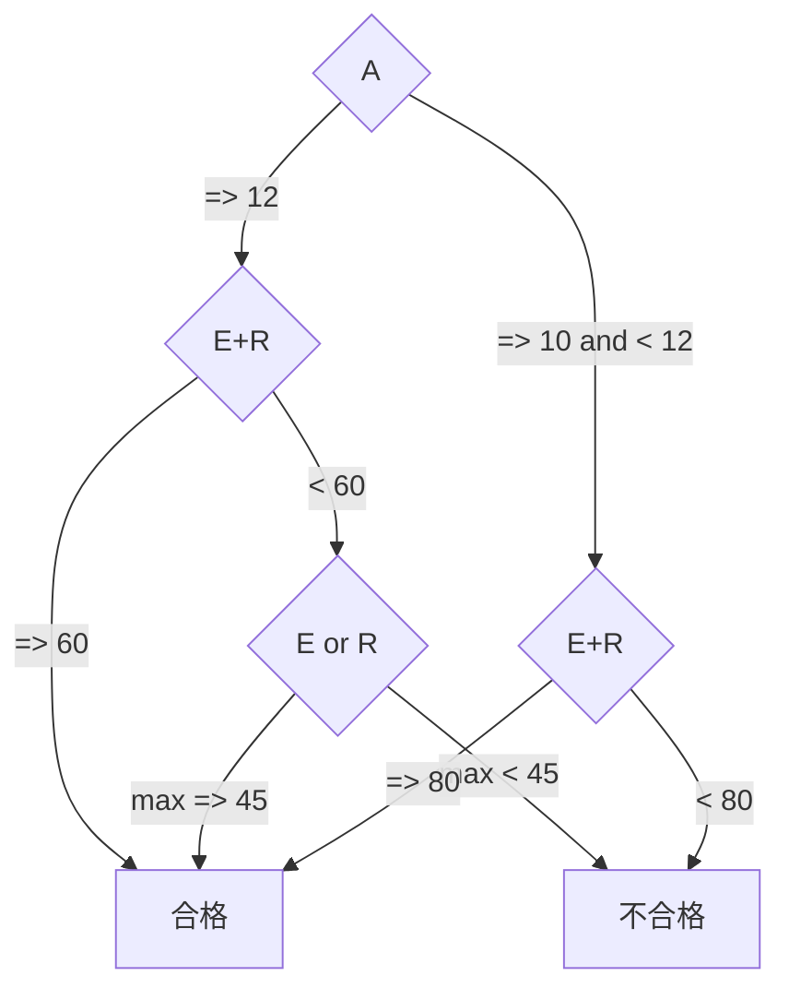

```mermaid

%% 1
%% flowchart TD
%% attend[A]
%% exam[E]
%% pass[合格]
%% fail[不合格]

%% attend -->|< 12| fail
%% attend -->|=> 12| exam
%% exam -->|=> 60| pass
%% exam -->|< 60| fail


%% 2
%% flowchart TD
%% attend{A}
%% exam{E}
%% pass[合格]
%% fail[不合格]
%% report{R}
%% goukei{E+R}

%% attend -->|< 12| fail
%% attend -->|=> 12| goukei
%% goukei -->|=> 60| pass
%% goukei -->|< 60| exam
%% exam -->|=> 45 | pass
%% exam -->|< 45 | fail


%% 3
%% flowchart TD
%% attend{A}
%% exam{E}
%% pass[合格]
%% fail[不合格]
%% goukei{E+R}

%% goukei2{E+R}

%% attend -->|=> 10 and < 12| goukei2
%% attend -->|=> 12| goukei
%% goukei -->|=> 60| pass
%% goukei -->|< 60| exam
%% exam -->|=> 45 | pass
%% exam -->|< 45 | fail

%% goukei2 -->|=> 80| pass
%% goukei2 -->|< 80| fail


%% 4
flowchart TD
attend{A}
E_or_R{E or R}
pass[合格]
fail[不合格]
goukei{E+R}

goukei2{E+R}

attend -->|=> 10 and < 12| goukei2
attend -->|=> 12| goukei
goukei -->|=> 60| pass
goukei -->|< 60| E_or_R
E_or_R -->|max => 45 | pass
E_or_R -->|max < 45 | fail

goukei2 -->|=> 80| pass
goukei2 -->|< 80| fail

```