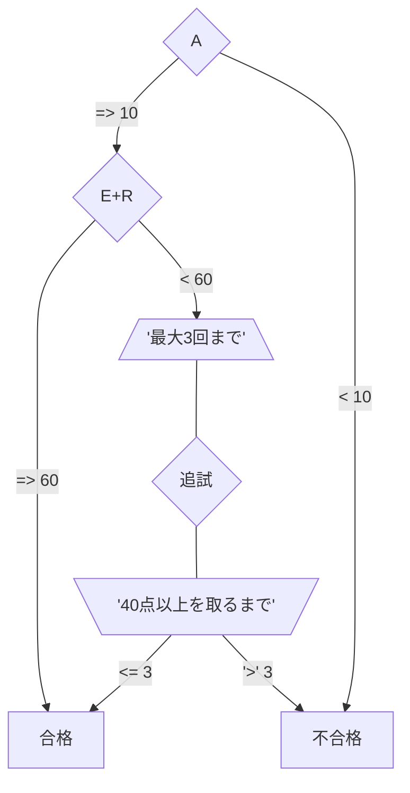

```mermaid

flowchart TD
attend{A}
pass[合格]
fail[不合格]
goukei{E+R}
tuisi{追試}

attend -->|=> 10| goukei
attend -->|< 10| fail
goukei -->|=> 60| pass
goukei -->|< 60| loop

loop[/'最大3回まで'\]
loopend[\'40点以上を取るまで'/]
loop --- tuisi --- loopend

loopend -->|<= 3| pass
loopend -->|'>' 3| fail


```