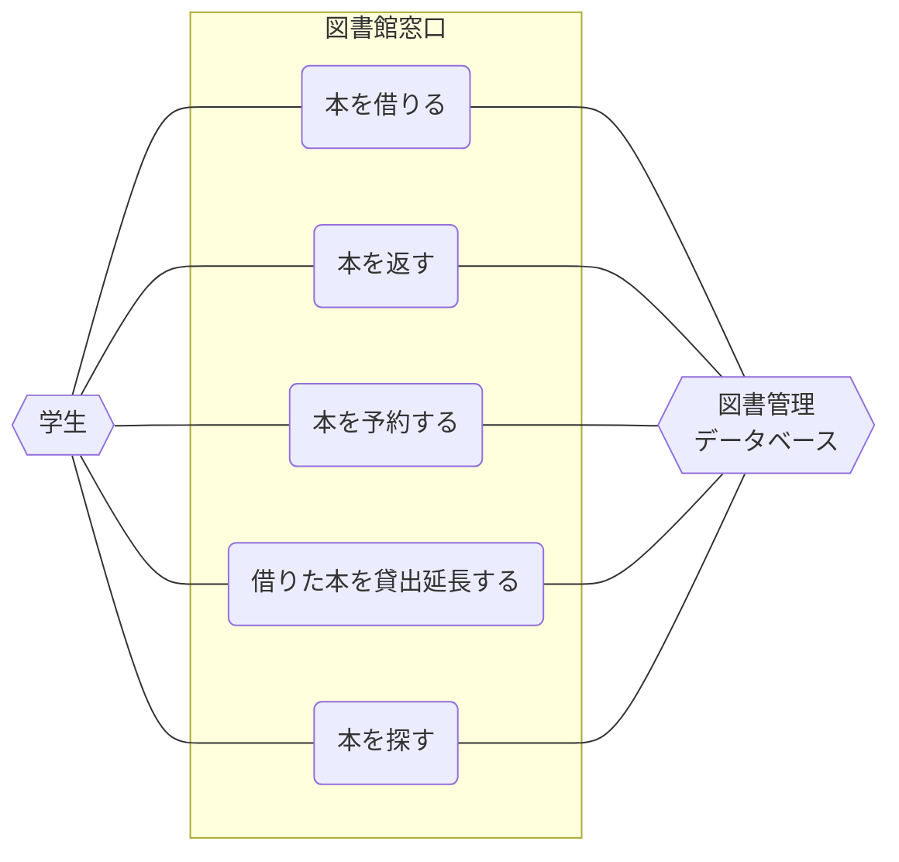

```mermaid

flowchart LR

学生{{学生}}
借りる(本を借りる)
返す(本を返す)
予約(本を予約する)
延長(借りた本を貸出延長する)
探す(本を探す)

学生 --- 借りる
学生 --- 返す
学生 --- 予約
学生 --- 延長
学生 --- 探す

データベース{{図書管理
データベース}}
借りる --- データベース
返す --- データベース
予約 --- データベース
延長 --- データベース
探す --- データベース

subgraph 図書館窓口
探す
借りる
返す
予約
延長
end

```